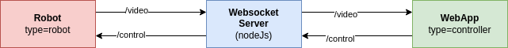

# Websocket Robo Controller

Websocket based controller for transmitting video and control signals via web app (React).

## Get started

Make changes in docker-compose.yaml and spin up the server. Make sure your ports are forwarded (8080) and the reverse proxy allows a connection from outside.

## Control String for Robots:

For unsecured ws:

    ws://<Host with Port>/control?token=<Token>&robotid=<robotId>&type=robot

For secured wss:
    wss://<Host with Port>/control?token=<Token>&robotid=<robotId>&type=robot

## Video String for Robots:

For unsecured ws:

    ws://<Host with Port>/video?token=<Token>&robotid=<robotId>&type=robot

For secured wss:
    wss://<Host with Port>/video?token=<Token>&robotid=<robotId>&type=robot

## Control String for WebApp:

For unsecured ws:

    ws://<Host with Port>/control?token=<Token>&robotid=<robotId>&type=controller

For secured wss:
    wss://<Host with Port>/control?token=<Token>&robotid=<robotId>&type=controller

## Video String for WebApp:

For unsecured ws:

    ws://<Host with Port>/video?token=<Token>&robotid=<robotId>&type=controller

For secured wss:
    wss://<Host with Port>/video?token=<Token>&robotid=<robotId>&type=controller

